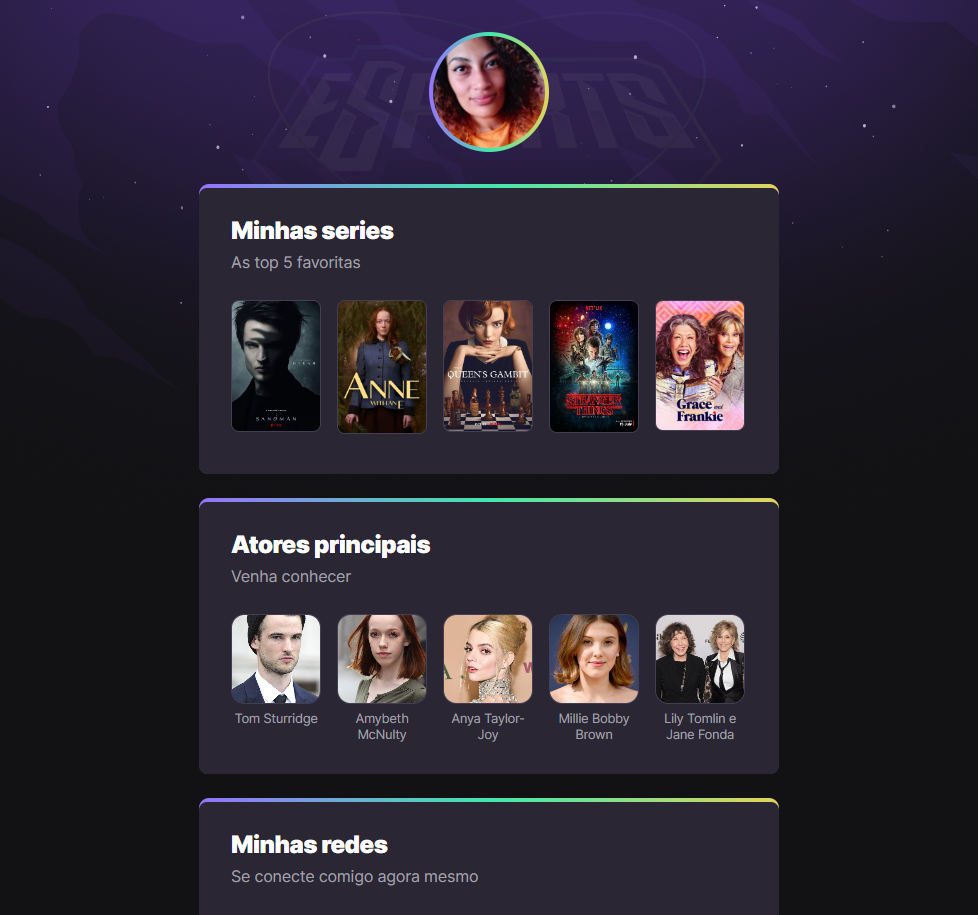

# NLW eSports 
> Trilha Explorer

Projeto construído do evento Next Level da Rocketseat.

[🔗Clique aqui para acessar](https://suelen-meneses.github.io/nlw-esports-explorer/)

## Tecnologias 

- HTML
- CSS
- Git e Github

## Contatos 
suelen.cristina.ff@gmail.com

 

Estou na segunda jornada de muito aprendizado. A nlw
me trouxe uma experiência maravilhosa. Aqui aprendi a como fazer um projeto do zero
super focado na prática, aprendi em como fazer os cardes e sua coloração degrade, imagem ao fundo e deixar os cantos todos aredondados. 
Esse novo caminho que estou me disperta ainda mais em ter conhecimento na área.

